# INCIDENT RESPONSE INVESTIGATION USING WIRESHARK

## Task 1: Setting Up the Investigation Environment
1. Configure a Bridged Network for Both VMs
   - Open VirtualBox or VMware.
   - Navigate to Settings > Network for each VM.
   - Change the adapter to Bridged Adapter.
   - Rename the VMs: Right-click each VM in VirtualBox or VMware and rename: 
      - ALTSOE0242887KaliVM
      - ALTSOE0242887WindowsVM
   - Boot both Windows and Kali Linux VMs.
   - Verify network configuration: On Windows: Open Command Prompt and run: powershell

```
ipconfig
```
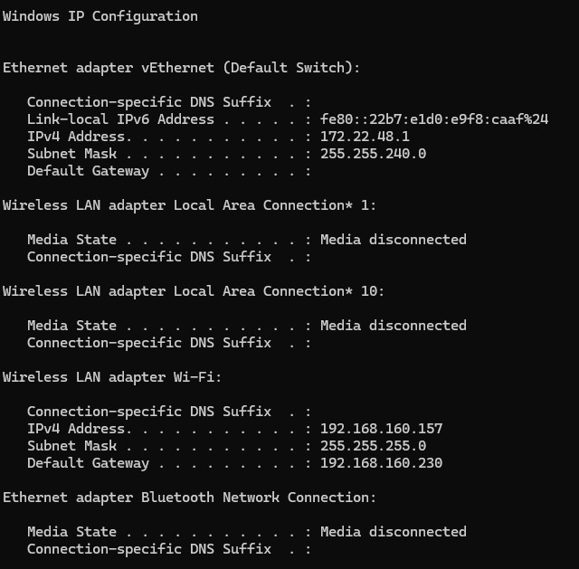

- On Kali Linux: Open Terminal and run:
```
ip a or ifconfig
```
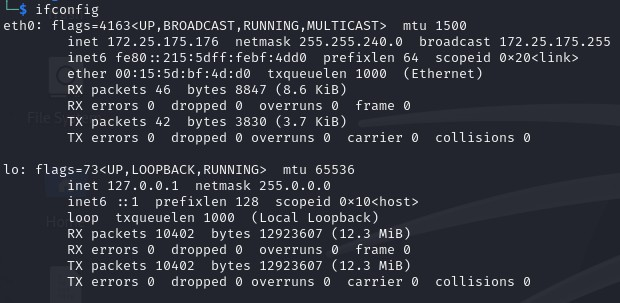

Note down the IP addresses of both systems.

## Task 2: Monitoring Network Traffic for Suspicious Activity

- Install Wireshark on Windows VM
- Download Wireshark from Wireshark.org
- Install it with default settings.
- Open Wireshark and select the active network adapter (Ethernet/Wi-Fi).
- Start packet capture.
- Take a screenshot showing Wireshark installed and running.

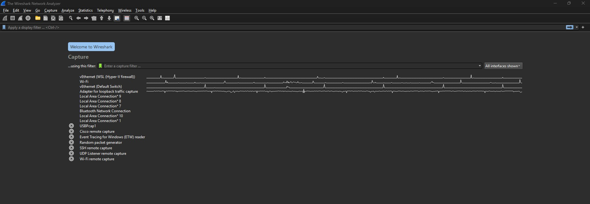

## Task 3: Simulating a Possible Attack (ICMP Flood)
From Kali Linux, run a Ping Flood attack on Windows: `ping -f <Windows_IP>`

```
ping -f 192.168.160.157
```

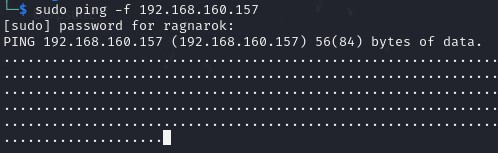

This command sends rapid ICMP packets to flood the target.

- On Windows, monitor traffic in Wireshark: Look for ICMP requests flooding the system.

Screenshot showing the detected ICMP flood packets

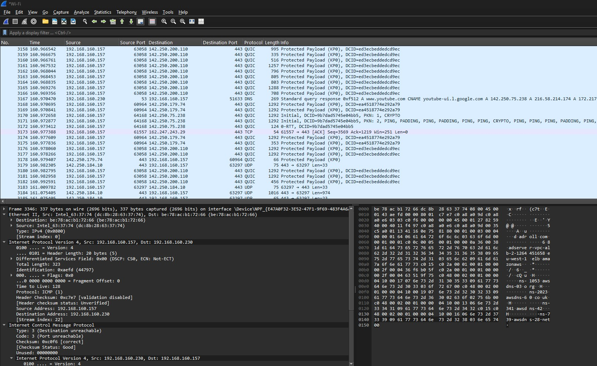

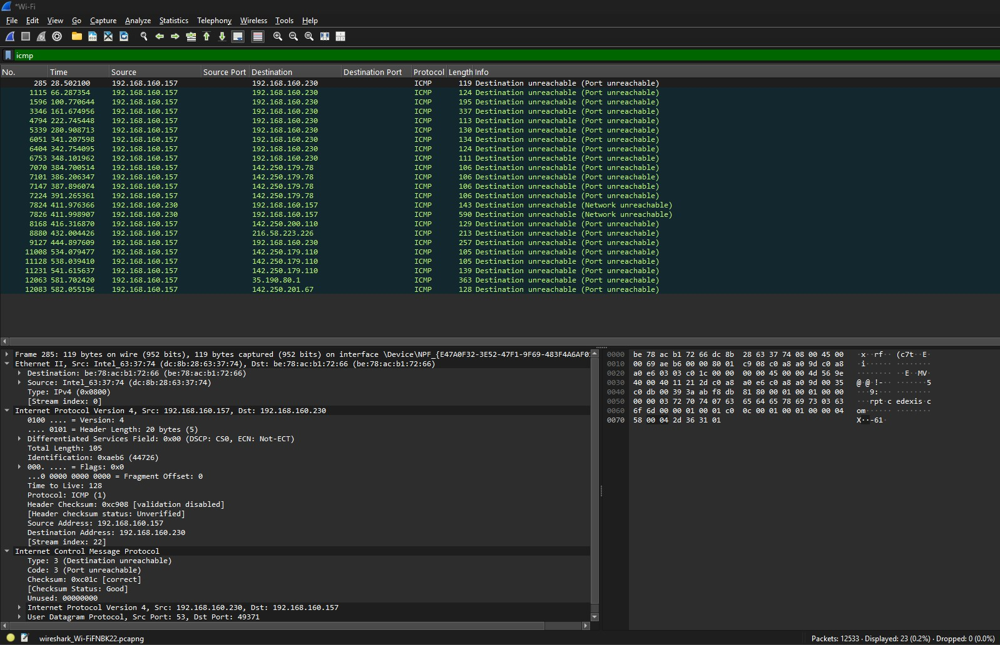

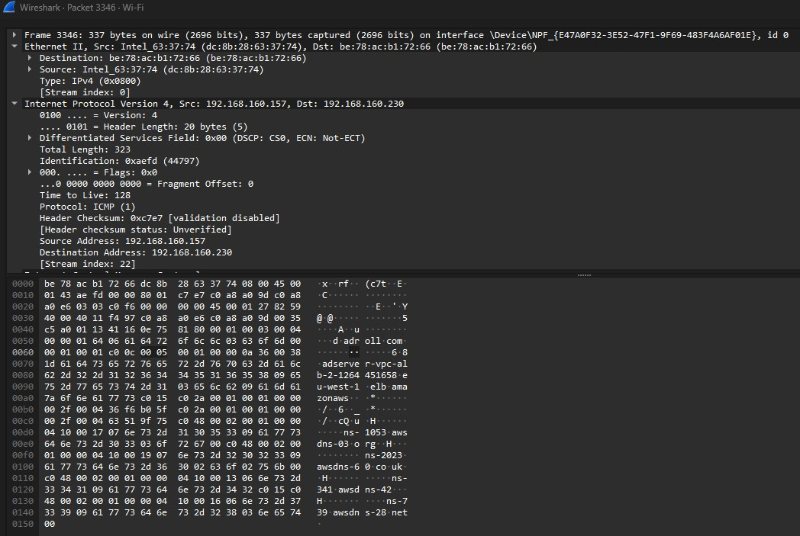

## Task 4: Analyzing HTTP Traffic for Possible Data Leakage
- Open Wireshark
- Start a new capture on the relevant network interface (e.g., Ethernet or Wi-Fi).
- Generate HTTP traffic:
   - From Windows open a web browser and visit: `http://altschoolafrica.com`

   - You could manually use the terminal to generate a request:

      
         curl -X GET http://altschoolafrica.com
         curl -X POST -d "username=admin&password=1234" http://altschoolafrica.com/login

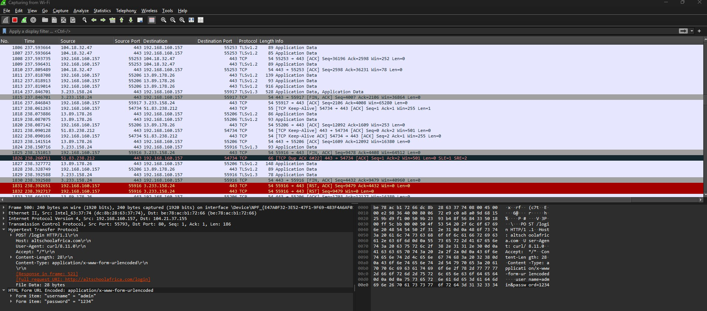

### TO GET and POST requests.

### STEPS

1. Apply HTTP Filters in Wireshark
1. Once you have captured traffic, use the following filters in the Wireshark Filter Bar:

   - Filter for HTTP Traffic, This will display all HTTP packets.

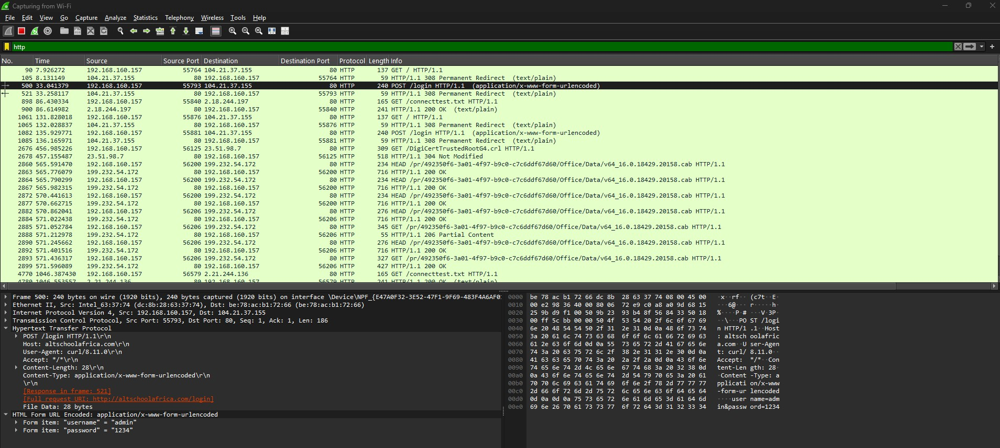

- Filter for Only GET Requests
```
http.request.method == "GET"
```
   ***The command above shows only GET requests***

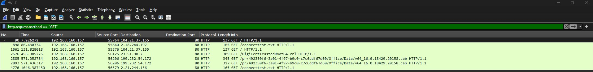

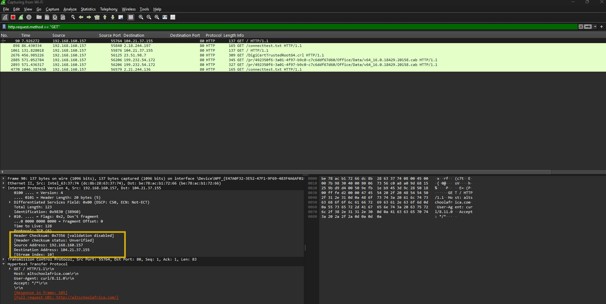


- Filter for Only POST Requests
```
http.request.method == "POST"
```
   ***The command above shows only POST requests***


**Filter for a Specific Website `altschoolafrica.com`**
   - If you want to check GET or POST requests to a specific domain, use:

```
http.host contains "altschoolafrica.com"
```
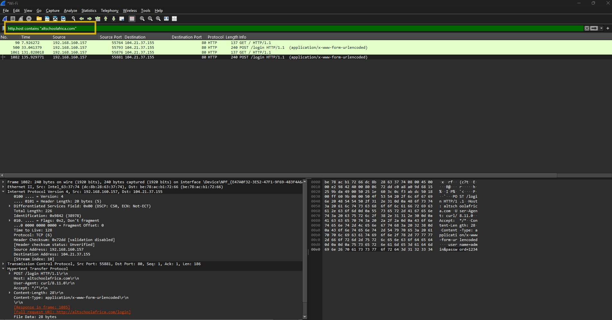

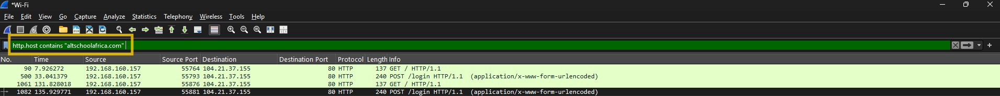

**Filter for a Specific URL**
   - If you want to check requests to a specific URL path, use:
```
http.request.uri contains "/login"
```
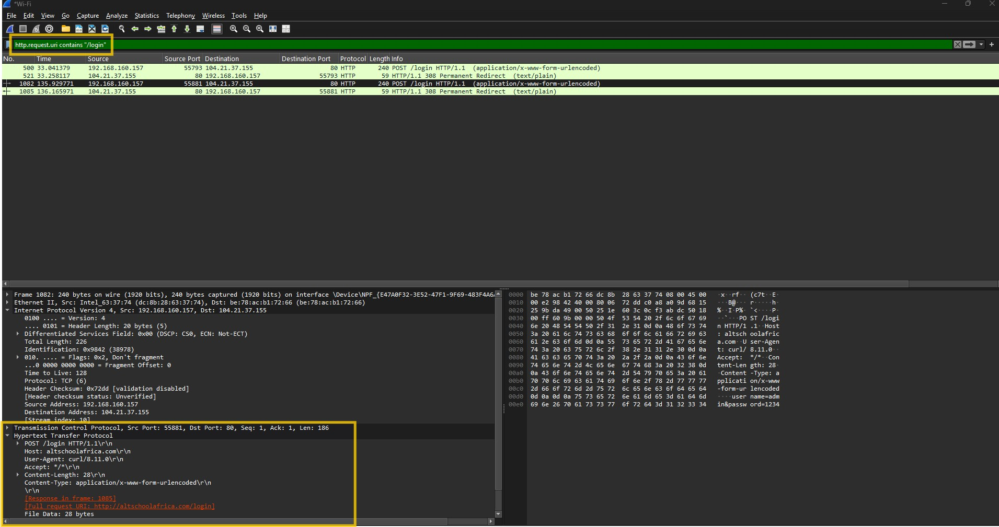

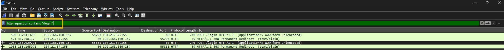

1. Analyzing the Results

- Click on a GET or POST packet in the capture window.
- Expand the Hypertext Transfer Protocol (HTTP) section in the packet details pane.
- Look for:
   - GET Request URL in GET /path HTTP/1.1
   - POST Form Data under the application/x-www-form-urlencoded section.

1. Exporting Results (Optional)

- You can export the filtered packets:

- File > Export Specified Packets (to save only HTTP requests).
- Right-click on a packet > Follow > HTTP Stream (to see full request and response).

#### Output

- Captured GET Request (Filtered):
```
Hypertext Transfer Protocol
    GET /index.html HTTP/1.1
    Host: altschoolafrica.com
```

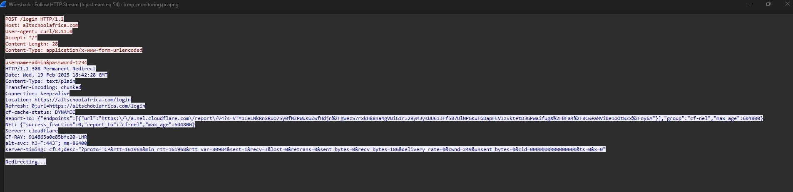

- Captured GET Request (Filtered):

```
Captured POST Request (Filtered):
Hypertext Transfer Protocol
    POST /login HTTP/1.1
    Host: altschoolafrica.com
    Content-Type: application/x-www-form-urlencoded
    username=admin&password=1234
```

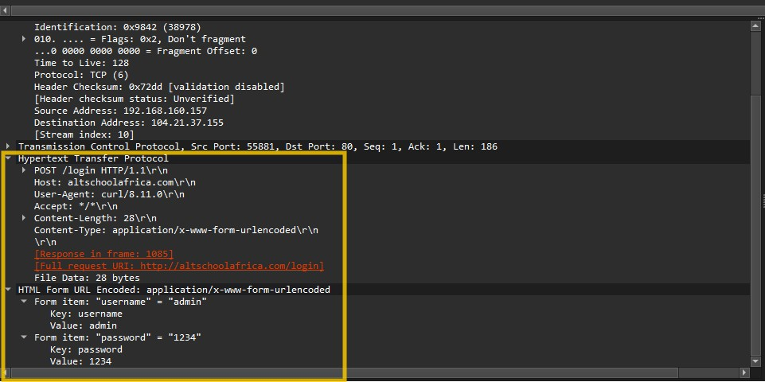

## Conclusion
Using Wireshark HTTP filters, you can easily track GET and POST requests, analyze login attempts, and detect potential security risks such as credential leaks or unauthorized data transfers.

## Task 5: Report Findings & Security Recommendations
1. Observations from Wireshark Captures
   - The ICMP flood attack showed excessive ICMP request packets from Kali Linux, which could cause network congestion/Denial of Service (DoS) attack.
   - The HTTP capture displayed plaintext GET requests, meaning data is unencrypted, making it susceptible and accessible to Man-in-the-Middle (MITM) attacks.

1. Security Recommendations
   - Enable Firewall Rules: Block excessive ICMP traffic using Windows Firewall or iptables on Linux.

1. Use HTTPS Instead of HTTP
   - Websites should enforce HTTPS using SSL/TLS to prevent unencrypted data transmission for security purpose.

1. Implement Rate Limiting & Intrusion Detection
   - Use an IDS/IPS tools to detect abnormal traffic patterns.


